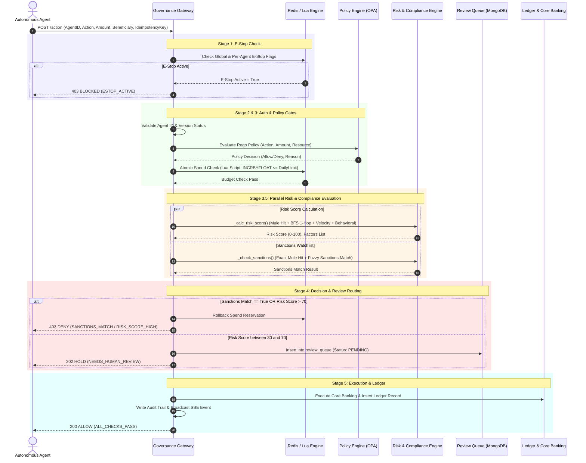
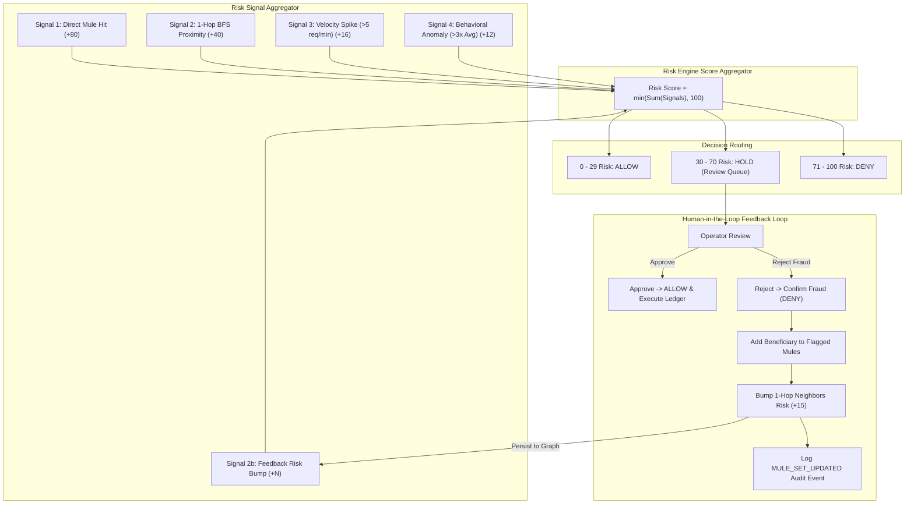
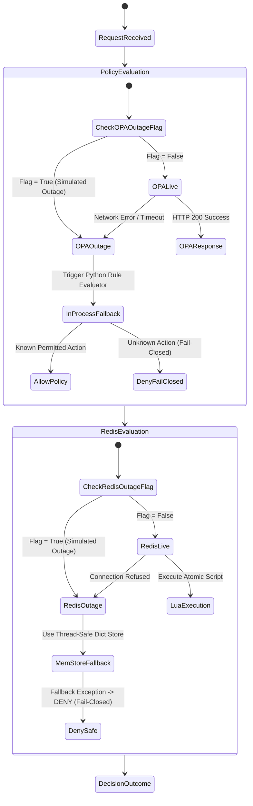

# Architecture Diagrams — Antigravity Governance Gateway

## Overview
This document presents the complete architectural design of the **Autonomous AI Financial Agent Governance Gateway**. It covers system components, pipeline orchestration sequence, multi-signal risk engine calculations, feedback loop dynamics, and fail-closed redundancy mechanisms using GitHub-flavored Mermaid diagrams.

---

## 1. System High-Level Architecture Diagram

```mermaid
flowchart TB
    subgraph ClientLayer["Autonomous Agent Fleet & Operators"]
        AgentA["Agent Alpha (Compliant)"]
        AgentB["Agent Beta (High-Volume)"]
        AgentR["Agent Rogue (Malicious)"]
        Dashboard["React Dashboard (Port 5173)"]
    end

    subgraph GatewayCore["Governance Gateway (FastAPI - Port 8000)"]
        API["POST /action Entrypoint"]
        SimAPI["POST /action/simulate (Dry-Run)"]
        IdemCache["Idempotency Cache Check"]
        
        subgraph Pipeline["6-Stage Authorization Pipeline"]
            F1["Stage 1: E-Stop Check"]
            F2["Stage 2: Agent Auth & Version"]
            F3["Stage 3: Governance & Spend Cap"]
            F4["Stage 3.5: Parallel Risk & Compliance"]
            F5["Stage 4: Decision & Review Routing"]
            F6["Stage 5: Core Banking Execution"]
        end

        SSE["SSE Broadcast Engine (/live)"]
        Audit["Fail-Safe Audit Logger"]
    end

    subgraph ExternalEngine["Compliance & Policy Engines"]
        OPA["Open Policy Agent (Rego Sidecar :8181)"]
        NetworkX["NetworkX Mule Graph (In-Memory)"]
        SanctionsDB["Sanctions & AML Watchlist"]
    end

    subgraph PersistenceLayer["Multi-Tier Storage"]
        Redis["Redis (Lua Spend Cap & E-Stops)"]
        Mongo["MongoDB Atlas (Audit, Review, Agents)"]
        SQLite["SQLite Fallback (governance_fallback.db)"]
    end

    AgentA -->|POST /action| API
    AgentB -->|POST /action| API
    AgentR -->|POST /action| API
    Dashboard -->|POST /action/simulate| SimAPI
    Dashboard -->|GET /live (SSE)| SSE

    API --> IdemCache
    IdemCache -->|Cache Miss| Pipeline
    IdemCache -->|Cache Hit| Dashboard

    F1 --> Redis
    F2 --> Mongo
    F3 --> OPA
    F3 --> Redis
    F4 --> NetworkX
    F4 --> SanctionsDB
    F5 -->|Score 30-70| Mongo
    F6 --> Audit
    Audit --> Mongo
    Audit --> SQLite
    Pipeline --> SSE
```

---

## 2. 6-Stage Authorization Pipeline Sequence Diagram



---

## 3. Risk Engine & Feedback Loop Dynamics



---

## 4. Fail-Closed Resilience & Outage Simulation Tree


